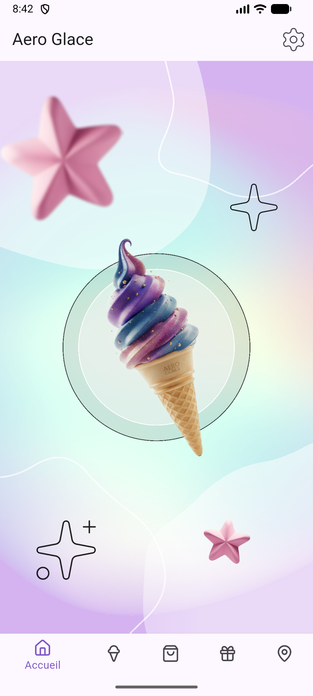
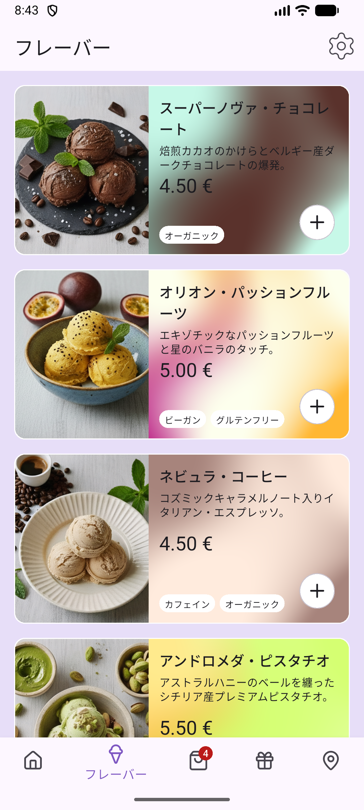
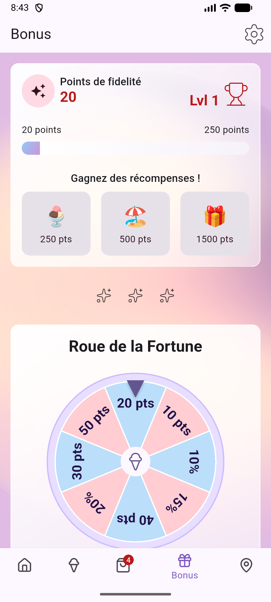
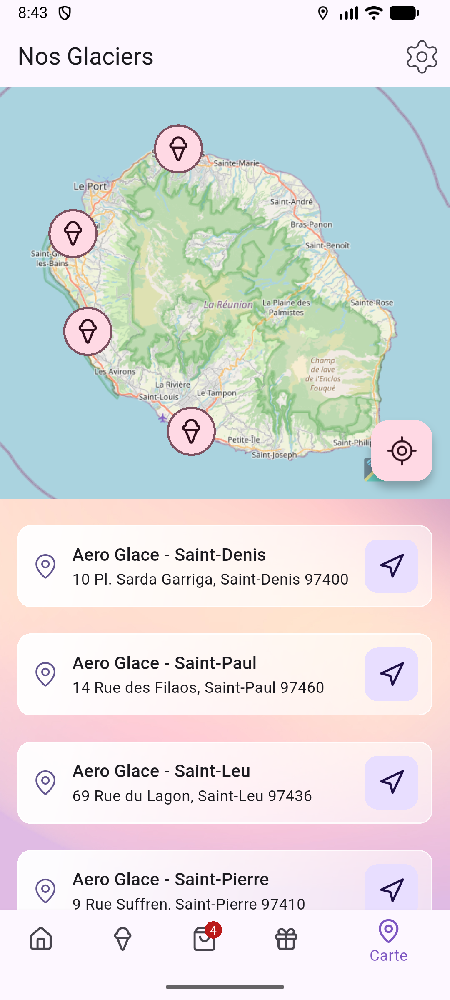

# Aero Glace

**Aero Glace** est une application mobile **futuriste** développée avec **Flutter**. Elle permet aux utilisateurs de :

- **Découvrir** les parfums de glaces disponibles.
- **Gérer un panier** pour commander leurs parfums préférés.
- **Jouer la roue de la fortune** pour gagnez des récompenses.
- **Localiser** les boutiques **Aero Glace** à proximité.
- **Calculer des itinéraires** pour se rendre dans la boutique de leur choix.

## Objectifs du projet

Cette application fait partie de mon portfolio. Elle illustre :

- Ma capacité à développer des applications complètes avec Flutter
- Mon attention particulière à l'expérience utilisateur et aux détails visuels
- Ma compréhension des bonnes pratiques en développement mobile
- Mon aptitude à travailler sur des projets techniques dans un cadre professionnel

## Design Futuriste

L'application suit un design futuriste avec :

- Une palette de couleurs pastels (bleus, violets, rouges) pour évoquer la fraîcheur des glaces
- Des animations fluides pour une expérience engageante
- Une hiérarchie visuelle claire pour guider l'utilisateur
- Des composants "glossy" : Cartes avec des effets de réflexion pour un rendu high-tech.
- Une typographie moderne : Polices futuristes pour les titres et les textes.

## Captures d'Écran

| Accueil                              | Liste des Parfums                             |
| ------------------------------------ | --------------------------------------------- |
|  |  |

| Panier avec Articles                          | Boîte de Dialogue                                  |
| --------------------------------------------- | -------------------------------------------------- |
|  |  |

| Roue de la Fortune                                   | Carte Interactive                         |
| ---------------------------------------------------- | ----------------------------------------- |
|  |  |

## Fonctionnalités

### **Liste des Parfums**

- Affichage de tous les parfums de glaces disponibles.
- Fiches détaillées pour chaque parfum (description, image, prix).
- Possibilité d'ajouter un parfum au panier directement depuis la liste.

### **Panier d'achat**

- Visualisation des parfums sélectionnés.
- Modification des quantités pour chaque article.
- Calcul automatique du total avec et sans remise.
- Validation de la commande (simulée).

### **Roue de la Fortune**

- Système de réductions et de points avec gestion des récompenses
- Date du dernier spin (pour réactiver la roue après 24h)
- Résultat du dernier tirage (réduction ou points gagnés)
- Statut d'activation de la roue

### **Carte Interactive**

- Localisation en temps réel de l'utilisateur.
- Affichage des boutiques **Aero Glace** sous forme de marqueurs interactifs.
- Calcul d'itinéraire optimisé entre la position de l'utilisateur et la boutique sélectionnée.
- Affichage de la distance et de la durée estimée pour rejoindre la boutique.

### **Paramètres et Personnalisation**

- Activation/désactivation de la localisation.
- Choix de la langue (français, anglais, etc.).

### **Persistance des Données**

- L'application utilise **Hive**, une solution de stockage local légère et rapide, pour sauvegarder et restaurer l'état entre les sessions.

## Technologies utilisées

- **UI/UX** : Design fait via [Figma](https://www.figma.com/design/4TXDaSbgnmlZWAzM5JrFnh/Aero-Glace?node-id=131-34&t=Jz2tElGKpRM42F7x-1)
- **Framework** : [Flutter](https://flutter.dev/) (Dart)
- **Cartographie** : [Flutter Map](https://docs.fleaflet.dev/) + [OpenStreetMap](https://www.openstreetmap.org/)
- **Routage** : API [OSRM](http://project-osrm.org/) pour le calcul d'itinéraires
- **Localisation** : Package [`location`](https://pub.dev/packages/location) pour la géolocalisation
- **Permissions** : Package [`permission_handler`](https://pub.dev/packages/permission_handler) pour la gestion des autorisations
- **Stockage local** : Package [`Hive`](https://pub.dev/packages/hive_flutter)
- **Internationalisation** : Package [`easy_localization`](https://pub.dev/packages/easy_localization) pour la traduction

# Structure du Projet

```
lib/
|── data/ # Données statiques de l'application
|── features/ # Fonctionnalités principales de l'application, organisées par domaine
		|── bonus/
		|── flavors/
		|── map/
		|── cart/
├── generated/ # Fichiers d'internationalisation générés
├── models/ # Modèles de données (FortuneOutcome, Cart, etc.)
├── pages/ # Écrans principaux de l'application
├── providers/ # Gestion d'état avec Provider
├── widgets/ # Composants réutilisables
├── utils/ # Fonctions utilitaires et helpers
└── main.dart # Point d'entrée de l'application
```

# Contact

Pour toute question ou opportunité professionnelle :

- Email : em.majowska@gmail.com
- Projet de portfolio : (https://em-majowska.github.io/my-portfolio/)
